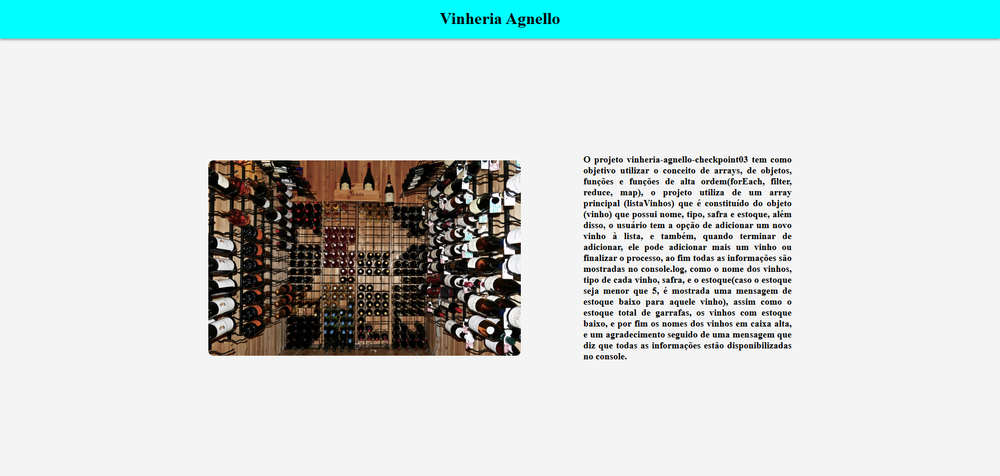

# vinheria-agnello-checkpoint03

O projeto vinheria-agnello-checkpoint03 tem como objetivo utilizar o conceito de arrays, de objetos, funções e funções de alta ordem(forEach, filter, reduce, map), o projeto utiliza de um array principal (listaVinhos) que é constituído do objeto (vinho) que possui nome, tipo, safra e estoque, além disso, o usuário tem a opção de adicionar um novo vinho à lista, e também, quando terminar de adicionar, ele pode adicionar mais um vinho ou finalizar o processo, ao fim todas as informações são mostradas no console.log, como o nome dos vinhos, tipo de cada vinho, safra, e o estoque(caso o estoque seja menor que 5, é mostrada uma mensagem de estoque baixo para aquele vinho), assim como o estoque total de garrafas, os vinhos com estoque baixo, e por fim os nomes dos vinhos em caixa alta, e um agradecimento seguido de uma mensagem que diz que todas as informações estão disponibilizadas no console.

Murilo Macedo Pina - RM: 563397

Link do GitHub Pages - https://muriloonn.github.io/vinheria-agnello-checkpoint03/

